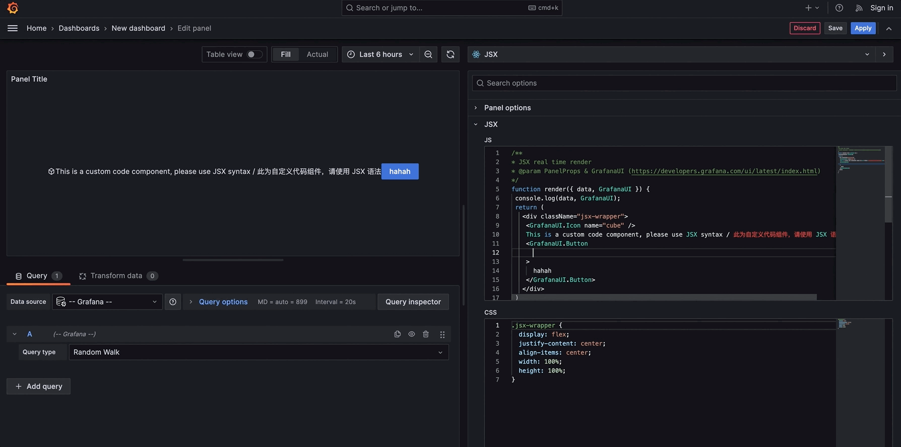

# Grafana Jsx Panel
A JSX real-time rendering Grafana panel plugin.

[简体中文](./README-zh_CN.md) | English

## Feature
- 🔄 Real-time transpilation based on @babel/standalone, allowing customization of panel components through JSX syntax.
- ✏️ Smooth code editing experience.
- 📚 Direct access to the @grafana/ui component library.

## Demo
